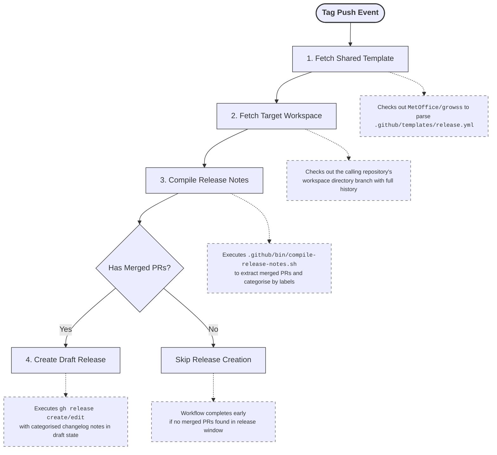

# Draft Release

A reusable GitHub Actions [workflow](../.github/workflows/draft-release.yaml)
that automates the creation of a draft GitHub release with an auto-generated
changelog, driven by a centralised shared release template.

## Features

- **Zero Boilerplate:** Fetches a centralised configuration template from
  [MetOffice/growss](https://github.com/MetOffice/growss) and injects it into
  the calling repository at runtime. Downstream repositories do not need to
  maintain a local `.github/release.yml` file.
- **Strict Label Prioritisation:** Generates a structured changelog dynamically
  grouped by PR labels using the centralised
  [release template](../.github/templates/release.yml).
- **Safe Review Gate:** Creates the release in **draft** state, allowing
  maintainers to audit or adjust notes before going live.
- **Secure Architecture:** Native platform authentication passes `GITHUB_TOKEN`
  seamlessly to handle both public and private repository cross-boundary
  checkouts securely.
- **Skip Empty Releases:** Automatically skips draft release creation if no
  merged PRs are found within the release window.
- Tags the draft release with the triggering Git ref name (e.g. `v1.2.3`).

## Changelog Categories for Simulation Systems

Pull Requests are evaluated against all categories from **top to bottom**. If a
PR has multiple labels matching different categories, it will appear in **all
matching categories**. This allows a single PR to be listed in multiple sections
for comprehensive changelog organisation.

| Category | Labels | Example |
| -------- | ------ | ------- |
| 💥 Breaking Changes | `breaking-change` | Critical infrastructure changes, breaking adjustments, or API removals. |
| 📦 Dependency Updates | `dependency` | Updates to third-party dependencies, including security patches. |
| ⚠️ Deprecations | `deprecated` | Features or APIs that are being phased out, but still functional. |
| 🐛 Bug Fixes | `bugfix` | Code corrections or hotfixes resolving functional issues. |
| ✨ New Features | `feature` | Customer-facing features, enhancements, or structural additions. |
| 🔬 Scientific & Algorithmic Updates | `science`, `technical` | **science:** Domain-specific mathematical changes or model updates.<br>**technical:** Deep algorithmic optimisations or background logic shifts. |
| 📚 Documentation | `documentation` | Changes isolated to READMEs, inline code docstrings, scientific documentation, working practices, or other non-functional documentation updates. |
| ⚡ Performance Improvements | `optimisation` | Direct speed execution metrics, runtime improvements, memory, storage, or other resource optimisations. |
| ♻️ Refactoring | `refactor` | Code cleanup, modularisation, or other internal improvements without behavior changes. |

### Excluded Labels

PRs carrying any of the following labels are **hidden** from the changelog
output entirely, regardless of any other labels they carry:

| Label | Purpose |
| ----- | ------- |
| `build` | Changes affecting build tools or external compiler toolchains. |
| `chore` | General housekeeping, license updates, or minor administrative tasks. |
| `ci` | Modifications to GitHub Actions workflows or automation systems. |
| `ignore-changelog` | Escape-hatch label to manually suppress a specific PR from the logs. |
| `test` | Changes related to testing frameworks or test cases. |
| `wip` | Work in progress PRs that are not ready for release. |

## Permissions

The calling execution job block must explicitly declare `contents: write` to
authorise the native GitHub CLI runner to write assets and publish release
footprints:

```yaml
permissions:
    contents: write
    pull-requests: read
```

## Usage

To ensure deterministic behaviour across versions, use the same reference for
both the workflow and `template-ref`.

### Variant A: Production Tag Auto-Trigger (Recommended)

```yaml
name: Draft Release Deployment

on:
  push:
    tags:
      - "v*" # Triggers automatically for semantic production tags

jobs:
  release:
    uses: MetOffice/growss/.github/workflows/draft-release.yaml@main
    with:
      template-ref: "main"
    permissions:
      contents: write
      pull-requests: read
```

### Variant B: Hybrid Trigger (Tag Push + Manual Run)

```yaml
name: Draft Release Deployment

on:
  push:
    tags:
      - "v*"
  workflow_dispatch:

jobs:
  release:
    uses: MetOffice/growss/.github/workflows/draft-release.yaml@main
    with:
      template-ref: "main"
    permissions:
      contents: write
```

> [!WARNING] **Important Trigger Caveat:** The draft release title, tag mapping,
> and PR delta history bounds are determined dynamically from
> `${{ github.ref_name }}`.
>
> - Triggering via **Tag Push** ensures the title matches the target version tag
>   (e.g. `v1.2.3`).
> - Triggering via **Workflow Dispatch** uses the active branch name (e.g.
>   `main`) as the release name target, which will include all historical
>   unreleased commits instead of a bounded tag delta window.

## How It Works



## Licence

&copy; Crown copyright Met Office. See [LICENCE](../LICENCE) file for details.
