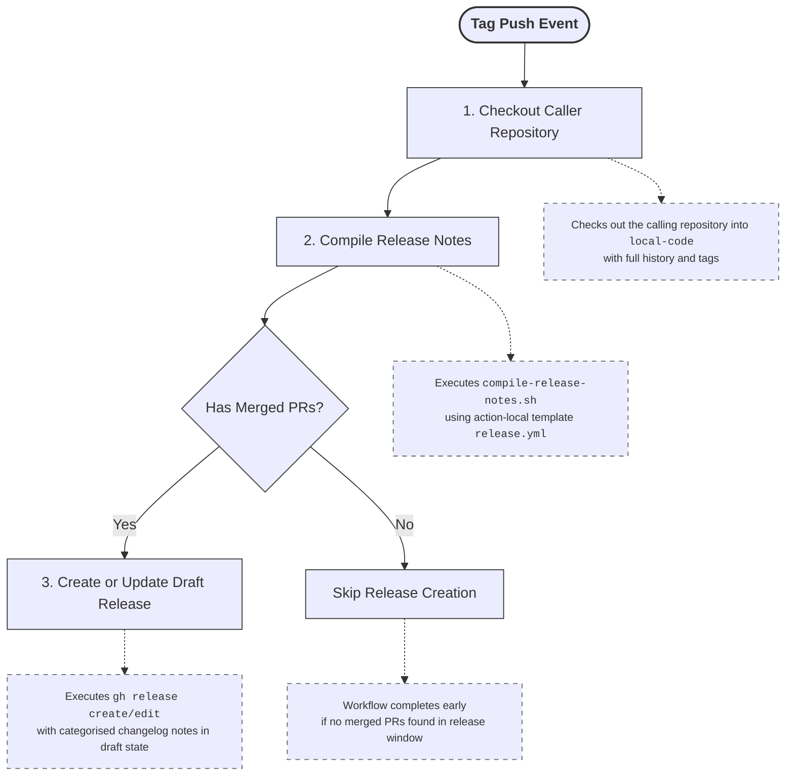

# Draft Release - a Shared Global Release Engine

Composite [action](action.yaml) that generates categorised draft release notes
from merged pull requests and updates (or creates) a draft GitHub Release for
the current tag.

## Location

This action is intentionally located at repository root level and has the
following components:

- `draft-release/action.yaml` (composite action)
- `draft-release/bin/compile-release-notes.sh` (compiler script)
- `draft-release/templates/release.yml` (release category template)
- `draft-release/README.md` (this document)

The changelog template source of truth is `draft-release/templates/release.yml`.

## Changelog Categories for Simulation Systems

Pull Requests are evaluated against all categories from **top to bottom**. If a
PR has multiple labels matching different categories, it will appear in **all
matching categories**. This allows a single PR to be listed in multiple sections
for comprehensive changelog organisation.

| Category | Labels | Example |
| -------- | ------ | ------- |
| 💥 Breaking Changes | `breaking-change` | Critical infrastructure changes, breaking adjustments, or API removals. |
| 📦 Dependency Updates | `dependency` | Updates to third-party dependencies, including security patches. |
| ⚠️ Deprecations | `deprecated` | Features or APIs that are being phased out, but still functional. |
| 🐛 Bug Fixes | `bugfix` | Code corrections or hotfixes resolving functional issues. |
| ✨ New Features | `feature` | Customer-facing features, enhancements, or structural additions. |
| 🔬 Scientific & Algorithmic Updates | `science`, `technical` | **science**: Domain-specific mathematical changes or model updates.<br>**technical**: Deep algorithmic optimisations or background logic shifts. |
| 📚 Documentation | `documentation` | Changes isolated to READMEs, inline code docstrings, scientific documentation, working practices, or other non-functional documentation updates. |
| ⚡ Performance Improvements | `optimisation` | Direct speed execution metrics, runtime improvements, memory, storage, or other resource optimisations. |
| ♻️ Refactoring | `refactor` | Code cleanup, modularisation, or other internal improvements without behavior changes. |
| 🛠️ Maintenance | `build`, `chore`, `ci` | **build**: Changes affecting build tools or external compiler toolchains.<br>**chore**: General housekeeping, licence updates, or minor administrative tasks.<br>**ci**: Changes to GitHub Actions workflows, CI/CD pipelines, or other automation.|

> [!NOTE]
> First time contributors are added automatically when the merged PR has an
> `author_association` of `FIRST_TIME_CONTRIBUTOR`.

### Excluded Labels

PRs carrying any of the following labels are **hidden** from the changelog
output entirely, regardless of any other labels they carry:

| Label | Purpose |
| ----- | ------- |
| `ignore-changelog` | Escape-hatch label to manually suppress a specific PR from the logs. |
| `test` | Changes related to testing frameworks or test cases. |
| `wip` | Work in progress PRs that are not ready for release. |

## How It Works

1. Checks out the caller repository into `local-code` with full tag history.
2. Runs `draft-release/bin/compile-release-notes.sh` to:
    - find release commits,
    - map merged PRs to changelog categories from
      `draft-release/templates/release.yml`,
    - write `release-notes.md` and set `has_commits` output.
3. If commits exist, creates or updates a draft release for the current tag.



## Usage

```yaml
name: Automated Release Notes

on:
    push:
        tags:
            - "v*"

jobs:
    release:
        runs-on: ubuntu-slim
        permissions:
            contents: write
            pull-requests: read
        steps:
            - name: Draft Release
              uses: MetOffice/growss/draft-release@main  # or tag or sha
```

## Required Permissions

- `contents: write` to create/edit draft releases.
- `pull-requests: read` to read merged PR metadata for changelog generation.

## Outputs

The compile step exposes:

- `has_commits`: `true` when release notes were generated from commits,
  otherwise `false`.

## Notes

- The action uses `${{ github.token }}` internally for `gh` API commands.
- `release-notes.md` is generated in the GitHub Actions workspace root.
- The release body is grouped by labels defined in
  `draft-release/templates/release.yml`.

## Licence

&copy; Crown copyright Met Office. See [LICENCE](../LICENCE) file for details.
